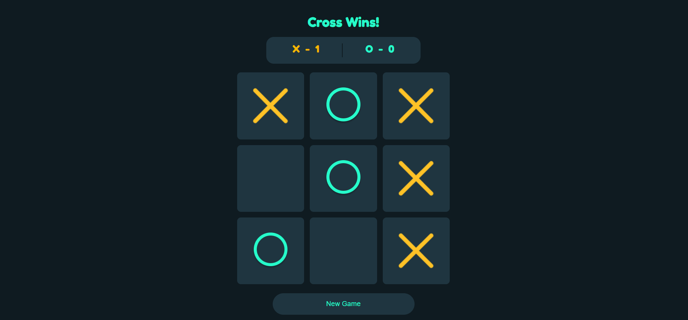

# Tic Tac Toe

A clean, responsive Tic Tac Toe game built with React featuring a live scoreboard and turn indicator.



---

## Features

- Two-player game (X and O)
- Live scoreboard that tracks wins across rounds
- Active player indicator with color highlight
- Responsive layout that works on all screen sizes
- New Game button to reset the board without clearing scores

---

## File Structure

```
tic-tac-toe/
├── public/
│   └── index.html
├── src/
│   ├── components/
│   │   ├── Assets/
│   │   │   ├── circle.png
│   │   │   └── cross.png
│   │   └── TicTacToe/
│   │       ├── TicTacToe.jsx
│   │       └── TicTacToe.css
│   ├── App.js
│   ├── App.css
│   ├── index.js
│   └── index.css
├── package.json
└── README.md
```

---

## Getting Started

### Prerequisites

- [Node.js](https://nodejs.org/) (v16 or higher)

### Clone the repository

```bash
git clone https://github.com/infosanuth/tic-tac-toe.git
cd tic-tac-toe
```

### Install dependencies

```bash
npm install
```

### Run the app

```bash
npm start
```

The app will open at http://localhost:3000.

---

## Built With

- React.js
- CSS3
